# Hi there! 👋 I'm Teephop Disawas

<!--
  ✏️ CUSTOMIZATION GUIDE:
  Replace the placeholders below with your actual information:
  - your.email@example.com → Your email address
  - your-profile → Your LinkedIn username
  - your-handle → Your Twitter/X handle
  - Update skills/technologies to match your expertise
-->

  

---

## 🚀 About Me

- 🔭 I'm currently working on **exciting projects**
- 🌱 I'm currently learning **new technologies**
- 👯 I'm looking to collaborate on **open source projects**
- 💬 Ask me about **anything you'd like**
- 📫 How to reach me: **6729011001@cdti.ac.th or tdisawas0@gmail.com**
- ⚡ Fun fact: **I love coding!**

---

## 🛠️ Skills & Technologies

### Programming Languages

### Frameworks & Libraries

### Languages

### Tools & Platforms

---

## 📊 GitHub Stats

  

  

  

---

## 🤝 Connect with Me

  

---

  

  
### Thanks for visiting! 😊

